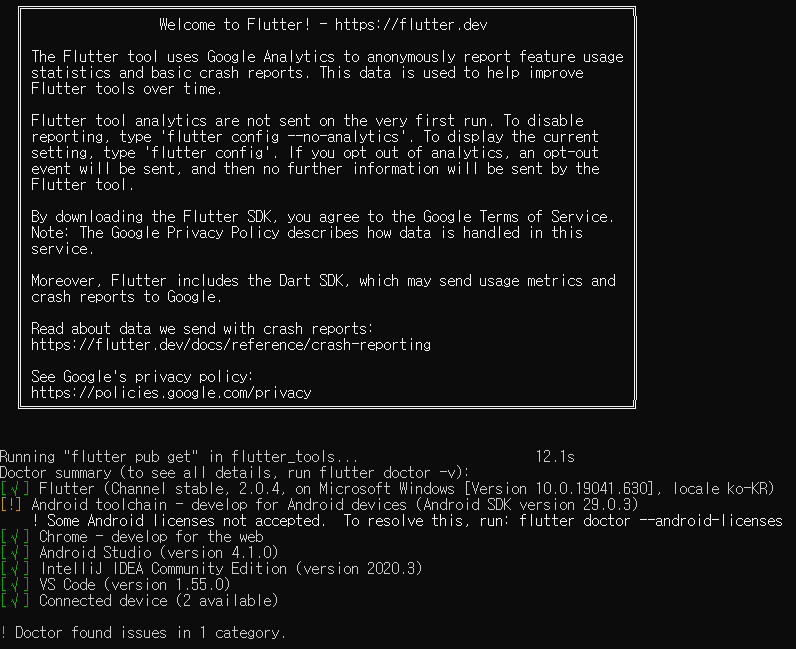
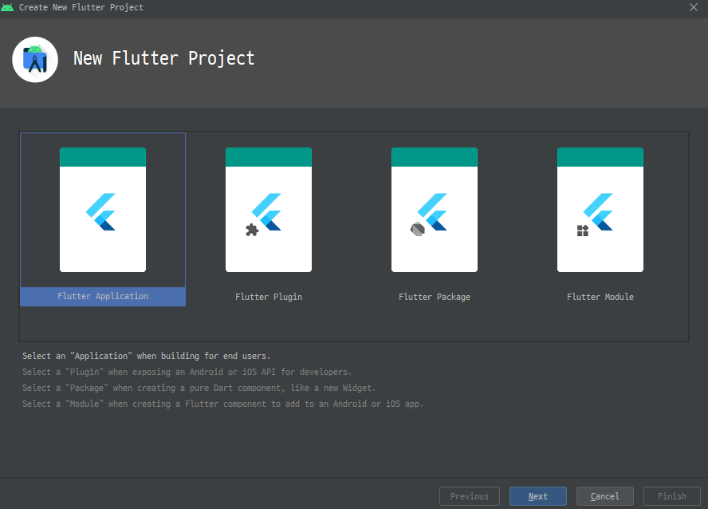
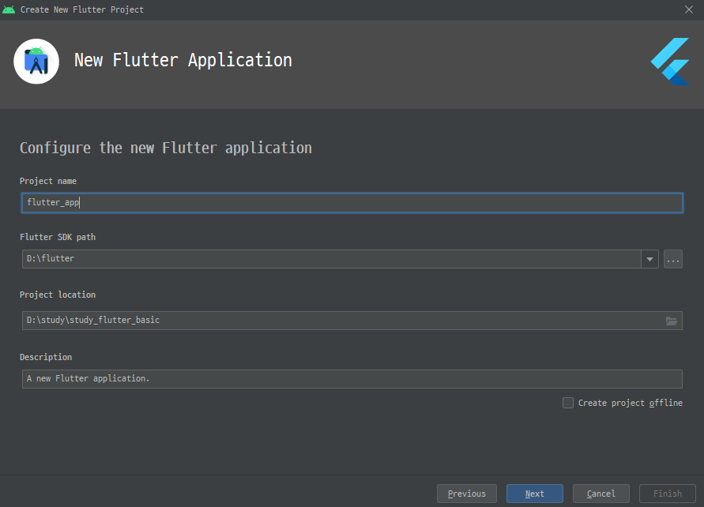
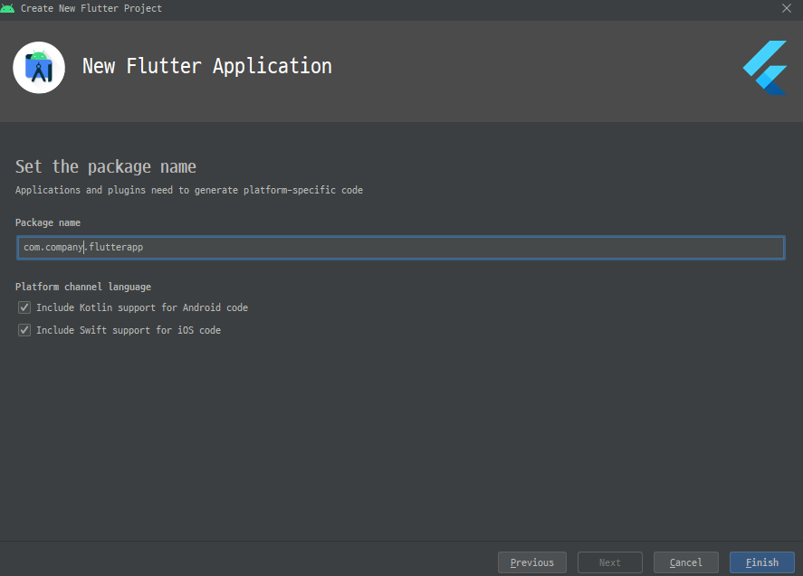
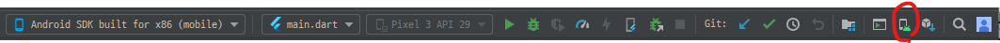
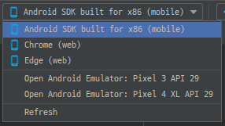
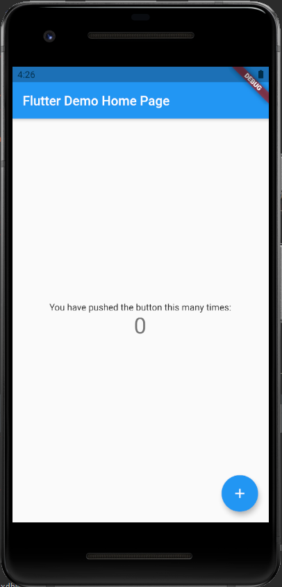
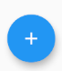

# Flutter 기본 


## Flutter ?
- 구글에서 만든 라이브러리
- Dart 언어 사용
- 한번에 ```Android```, ```Ios``` 개발가능
- 다른 하이브리드 개발과 다르게 Native 성능을 보여줌.


## 시작하기
- 다운로드 URL : https://flutter-ko.dev/docs/get-started/install/windows
- 환경변수 세팅하기 : 
>flutter\bin

- 안드로이드 스튜디오 설치 : 
- SDK 설치 : 개발하고자하는 안드로이드 버전 설치
- Plugin 설치 : Flutter

- 실행환경 확인 : ```cmd``` 실행하여 아래 명령어 실행
```
flutter docotr
```
사진과 같은 결과가 나올 것이다.
[](./images/2021-04-07-1-img-install.png)
toolchain 해결을 위해 아래 명령어를 실행하자
```
flutter doctor --android-licenses
y
y
y
y
```

## 프로젝트 세팅
1. Flutter 프로젝트 실행
   - [File] - [new Flutter Project] - [Flutter Application] - [com.회사명.어플리케이션 이름] (Kotlin, IOS 체크!!) - [완료]
   - [](./images/2021-04-07-3-flutter-application.png)
   - ```Flutter SDK Path``` 경로가 아까 다운받은 경로로 설정되어있는지 확인
   - [](./images/2021-04-07-4-flutter-sdk-path.png)
   - 프로젝트 위치 설정
   - [](./images/2021-04-07-5-application-name.png)
   - 완료
  
2. Device 설치
Android Studio 에서 개발하기 위해서 핸드폰과 같은 ```가상 Device```를 띄워 테스트를 할 수 있다.
   - [AVD Manager] - [원하는 기기 설치 및 클릭] - [Device 선택] - [실행]
   - [](./images/2021-04-07-6-findavdmanager.png)
   - 아래에서 설치한 Device 를 찾아 선택하면 Device가 실행된다. 
   - [](./images/2021-04-07-7-finddevice.png)
   - Device 실행 확인
   - [](./images/2021-04-07-8-checkDevice.png)

3. 프로젝트 구조 확인

> .dart_tool :
> .idea : 
> android : 안드로이드 소스
> build 
> ios : IOS 소스
> lib : 주로 수정하게 될 폴더, main.dart 파일이 현재 보여지는 화면이다.
> test : 테스트 코드 작성하는 폴더
> .gitignore : 버전관리시 누락 시킬 파일명명
> .metadata 
> .packages
> flutter_basic.iml
> pubspec.lock
> pubspec.yaml
> READMD.md : GIT 프로젝트 설명


## 알아야할 코드
1. AppBar
```
      home: Scaffold(
        appBar : AppBar(
           title :  Text('헬로 월드')
        ),
        body : Text('헬로 월드2'
        ,style : TextStyle(fontSize:30))
      ),
```

2. StatefulWidget
   - 상태값을 이용한 조절이 가능한 화면
   - 만들어진 Widget을 다른 곳에서 불러와 활용이 가능하다.
```
home: HelloPage('Hello World'),
....


class HelloPage extends StatefulWidget {
  final String title;

  HelloPage(this.title);

  @override
  _HelloPageState createState() => _HelloPageState();
}

class _HelloPageState extends State<HelloPage> {
  @override
  Widget build(BuildContext context) {
    return Scaffold(
      appBar: AppBar(
        title : Text(widget.title)
      ),
      body : Text(widget.title, style : TextStyle(fontSize: 30))
    );
  }
}
```

3. FloatingActtionButton 
[](./images/2021-04-07-9-floatingactionbutton.png)

```
      floatingActionButton: FloatingActionButton(
        child:Icon(Icons.add),
        onPressed: ()=>{},
      ),
```

4. setState()
이벤트가 발생했을때 ```_changeMessage()```을 실행시켜 ```setState()```로 ```_message``` 값을 변경시킨다.
```
  String _message = 'Hello World';

  void _changeMessage(){
    setState(() {
      _message = '헬로 월드';
    });
  }
```

5. Alignment
```Center```, ```Column```, ```mainAxisAlignment.center``` 를 이용한 화면 가로, 세로 가운데 정렬.
```
      body : Center(
        child:Column(
          mainAxisAlignment: MainAxisAlignment.center,
          children: <Widget>[
            Text(_message, style:TextStyle(fontSize:30)),
            Text('$_counter', style:TextStyle(fontSize:30)),
          ],
        )
      )
```

5. Tab Page
  - 탭의 상태를 관리해야하기 때문에 ```StatefulWidget```  로 페이지를 구성한다.
  - ```Scaffold```
  - ```bottomNavigationBar``` : 로 탭페이지 UI 를 구성한다. 내부 옵션중 ```items```(탭), ```currentIndex```(탭번호), ```onTap```(탭클릭시 이벤트)  로 탭의 상태를 구현할 수 있다.
  - ```body``` 에 탭클릭시 ```Scaffold``` 로 구성된 페이지의 전환을 볼 수 있다.

```
class TabPage extends StatefulWidget{
  @override
  _TabPageState createState() => _TabPageState();
}

class _TabPageState extends State<TabPage> {
  int _selectedIndex = 0;
  List _page = [
    Text('page1'),
    Text('page2'),
    Text('page3'),
  ];
  
  @override
  Widget build(BuildContext context){
    return Scaffold(
      body : Center(child:_page[_selectedIndex]),
      bottomNavigationBar: BottomNavigationBar(
        onTap: _onItemTapped,
        currentIndex: _selectedIndex,
        items:<BottomNavigationBarItem>[
          BottomNavigationBarItem(icon: Icon(Icons.home), title: Text('Home')),
          BottomNavigationBarItem(icon: Icon(Icons.search), title: Text('Search')),
          BottomNavigationBarItem(icon: Icon(Icons.account_circle), title: Text('Account')),
      ]),
    );
  }


  void _onItemTapped(int value) {
    setState(() {
      _selectedIndex = value;
    });
  }
}
```

6. SafeArea, SingleChildScrollView
- 디바이스 장치 크기에 따라서 화면이 어떻게 보일지 모르기 때문에(제대로보일지, 짤려서 보일지), 처음에는 스크롤을 추가해 놓는 것이좋다.

7. Padding(padding: EdgeInsets.all(8.0))
- 각 위젯 사이에 간격을 줄 때, ```Padding(padding: EdgeInsets.all(8.0))``` 이런 식으로 추가만 하면 된다.
8. SizedBox
- 크기가 정해진 형태를 만들 때, 선언하고 ```width```, ```height```를 선언한다.
- 내용은 ```child```안에 ```CircleAvatar``` 등으로 채울 수 있다.

9. RaisedButton
- 버튼

10. Row, Column
- Row : 다단식으로 배열을 잘라 표현한다.
- Column : 리스트처럼 위에서 아래로 내려오면서 배열을 잘라 표현한다.
- Row, Column 을 조합하여 화면을 구성한다.
```
....
child:Row(
  crossAxisAlignment: CrossAxisAlignment.start,
  mainAxisAlignment: MainAxisAlignment.spaceBetween,
  children: <Widget>[
    Column(
        ...
    ),
....
```

11.  Stack
12.  

13. Container
- SizedBox와 비슷하지만, Container 는 여러 요소를 감싸는 느낌으로 사용한다.
- 여러 SizedBox의 위치를 정렬하는 용도로 사용할 수 있다.
```
Container(
  width:80.0,
  height:80.0,
  alignment: Alignment.bottomRight,
  child: Stack(
    alignment: Alignment.center,
    children: [
      SizedBox(
          width:28.0,
          height:28.0,
          child: FloatingActionButton(
              onPressed: null,
              backgroundColor: Colors.white,
          )
      ),
      SizedBox(
          width:25.0,
          height:25.0,
          child: FloatingActionButton(
              onPressed: null,
              backgroundColor: Colors.blue,
              child : Icon(Icons.add)
          )
      )
    ],
  ),
)

```

14. GridView
- 인스타그램이나 특정 화면에서 동일한 형태의 도형이 반복되는 화면을 그릴때 사용
- 화면크기가 변경되어도 유동적으로 크기가 변하며 모양을 유지시킬 수 있다.
- ```crossAxisCount``` : 가로에 표현한 아이템 수
- ```childAspectRatio``` : 아이템 크기 비율
- ```mainAxisSpacing``` :  정렬 간격
- ```crossAxisSpacing``` : 가로 간격
- ```itemBuilder``` : 항목을 그리는 ??

```
  Widget _buildBody() {
    return GridView.builder(
      gridDelegate: SliverGridDelegateWithFixedCrossAxisCount(
        crossAxisCount: 3,
        childAspectRatio: 1.0,
        mainAxisSpacing: 1.0,
        crossAxisSpacing: 1.0
      ),
      itemCount: 5,
      itemBuilder: (context, index){
        return _buildListItem(context, index);
      });
  }

  Widget _buildListItem(BuildContext context, int index) {
    return Image.network('https://play-lh.googleusercontent.com/TVVIZnPw3rAi9o1DfCRH97UbbSRGqLo7fFKoDIYhQZ2j1B2T-fOQkDuLlCqki-gYKg');
  }
```

15. TextEditingController
- 글을 쓰는 입력 폼의 데이터를 핸들링할 수 있는 객체
- 화면이 정지될 때는 ```dispose```를 사용하여 메모리 삭제를 해주어야한다.
- 사용
```
TextField(
  decoration: InputDecoration(hintText: '내용을 입력하세요'),
  controller: textEditingController,
)
```
- 선언
```
final textEditingController = TextEditingController();
```
- 메모리 삭제
```
  @override
  void dispose() {
    // TODO: implement dispose
    textEditingController.dispose();
    super.dispose();
  }
```

## 인스타그램 클론


### 첫 페이지
```
  Widget _buildBody() {
    return Padding(
      padding: EdgeInsets.all(0.0),
      child: SafeArea(
        child:SingleChildScrollView(
          child:Center(
            child:Column(
              children: <Widget>[
                Text('Instargram에 오신 것을 환영합니다.',
                  style: TextStyle(fontSize: 24.0)
                ),
                Padding(padding: EdgeInsets.all(8.0)),
                Text('사진과 동영상을 보려면 팔로우해주세요.'),
                SizedBox(
                  width:260.0,
                  child:
                    Card(
                        elevation: 4.0,
                        child: Padding(
                          padding: const EdgeInsets.all(8.0),
                          child: Column(
                            children: <Widget>[
                              Padding(padding: EdgeInsets.all(1.0)),
                              SizedBox(
                                width:80.0,
                                height:80.0,
                                child:CircleAvatar(
                                  backgroundImage: NetworkImage('https://trialxxerror.medium.com/?source=post_page-----1474e54b55a0--------------------------------'),
                                )
                              ),
                              Padding(padding: EdgeInsets.all(8.0)),
                              Text('이메일 주소', style: TextStyle(fontWeight: FontWeight.bold)),
                              Text('이름'),
                              Padding(padding: EdgeInsets.all(8.0)),
                              Row(
                                mainAxisAlignment: MainAxisAlignment.center,
                                children: <Widget>[
                                  SizedBox(
                                    width:70.0,
                                    height:70.0,
                                    child: Image.network('https://miro.medium.com/max/4000/0*8l-9ohGsAquPq_rZ.jpeg', fit:BoxFit.cover),
                                  ),
                                  Padding(padding: EdgeInsets.all(1.0)),
                                  SizedBox(
                                    width:70.0,
                                    height:70.0,
                                    child: Image.network('https://image.edaily.co.kr/images/Photo/files/NP/S/2019/08/PS19082300690.jpg', fit:BoxFit.cover),
                                  ),
                                  Padding(padding: EdgeInsets.all(1.0)),
                                  SizedBox(
                                    width:70.0,
                                    height:70.0,
                                    child: Image.network('https://play-lh.googleusercontent.com/TVVIZnPw3rAi9o1DfCRH97UbbSRGqLo7fFKoDIYhQZ2j1B2T-fOQkDuLlCqki-gYKg', fit:BoxFit.cover),
                                  ),
                                ],
                              ),
                              Padding(padding: EdgeInsets.all(4.0)),
                              Text('Facebook 친구'),
                              Padding(padding: EdgeInsets.all(4.0)),
                              RaisedButton(
                                child:Text('팔로우'),
                                textColor: Colors.white,
                                color: Colors.blueAccent,
                                onPressed: ()=>{},
                              ),
                              Padding(padding: EdgeInsets.all(4.0)),
                            ],
                          ),
                        )
                    )
                )
              ],
            )
          )
        )
      )
    );
  }
```


### 계정 페이지
```

  Widget _buildBody() {
    return Padding(
      padding:EdgeInsets.all(16.0),
      child:Row(
        crossAxisAlignment: CrossAxisAlignment.start,
        mainAxisAlignment: MainAxisAlignment.spaceBetween,
        children: <Widget>[
          Column(
            children: <Widget>[
              Stack(
                children: <Widget>[
                  SizedBox(
                    width:80.0,
                    height:80.0,
                    child: CircleAvatar(
                      backgroundImage: NetworkImage('https://play-lh.googleusercontent.com/TVVIZnPw3rAi9o1DfCRH97UbbSRGqLo7fFKoDIYhQZ2j1B2T-fOQkDuLlCqki-gYKg'),
                    )
                  ),
                  Container(
                    width:80.0,
                    height:80.0,
                    alignment: Alignment.bottomRight,
                    child: Stack(
                      alignment: Alignment.center,
                      children: [
                        SizedBox(
                            width:28.0,
                            height:28.0,
                            child: FloatingActionButton(
                                onPressed: null,
                                backgroundColor: Colors.white,
                            )
                        ),
                        SizedBox(
                            width:25.0,
                            height:25.0,
                            child: FloatingActionButton(
                                onPressed: null,
                                backgroundColor: Colors.blue,
                                child : Icon(Icons.add)
                            )
                        )
                      ],
                    ),
                  )
                ],
              ),
              Padding(
                padding:EdgeInsets.all(8.0)
              ),
              Text(
                '이름',
                style:TextStyle(fontWeight: FontWeight.bold, fontSize: 18.0)
              )
            ],
          ),
          Text(
              '0\n게시물',
              textAlign: TextAlign.center,
              style: TextStyle(fontSize: 18.0),
          ),
          Text(
              '0\n팔로워',
              textAlign: TextAlign.center,
              style: TextStyle(fontSize: 18.0),
          ),
          Text(
              '0\n팔로잉',
              textAlign: TextAlign.center,
              style: TextStyle(fontSize: 18.0),
          ),
        ],
      )
    );
  }
```

### 조회 페이지

```
  Widget _buildBody() {
    return GridView.builder(
      gridDelegate: SliverGridDelegateWithFixedCrossAxisCount(
        crossAxisCount: 3,
        childAspectRatio: 1.0,
        mainAxisSpacing: 1.0,
        crossAxisSpacing: 1.0
      ),
      itemCount: 5,
      itemBuilder: (context, index){
        return _buildListItem(context, index);
      });
  }

  Widget _buildListItem(BuildContext context, int index) {
    return Image.network('https://play-lh.googleusercontent.com/TVVIZnPw3rAi9o1DfCRH97UbbSRGqLo7fFKoDIYhQZ2j1B2T-fOQkDuLlCqki-gYKg');
  }

```


### 글쓰기 페이지
```
...
  final textEditingController = TextEditingController();

  @override
  void dispose() {
    // TODO: implement dispose
    textEditingController.dispose();
    super.dispose();
  }
...


  Widget _buildAppBar() {
    return AppBar(
      actions: <Widget>[
        IconButton(
            icon: Icon(Icons.send),
            onPressed: ()=>{}
        )
      ],
    );
  }

  Widget _buildBody() {
    return Column(
      children: <Widget>[
        Text('No Image'),
        TextField(
          decoration: InputDecoration(hintText: '내용을 입력하세요'),
          controller: textEditingController,
        )
      ],
    );
  }
```