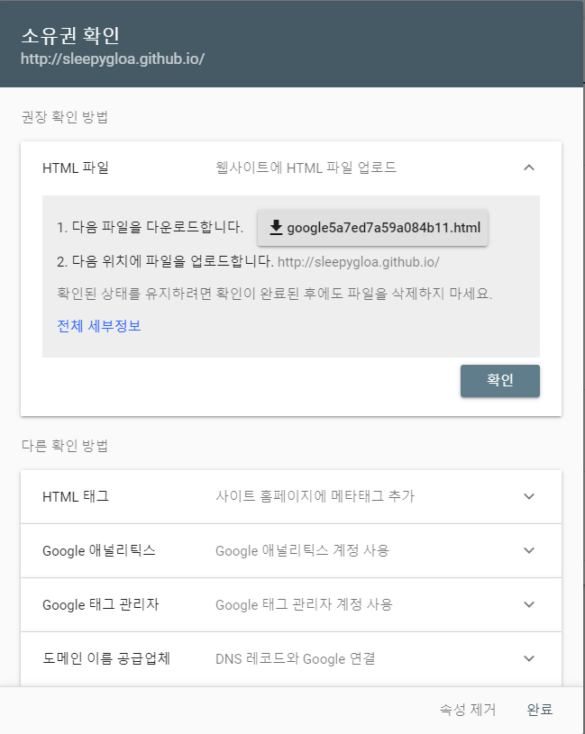

# 1. Google Search Console과 Google Analytics 알아보기


Google Search Console과 Google Analytics 두가지 서비스는 약간은 비슷하지만 엄연히 다른 서비스이다. 둘 간의 차이를 알고 정확한 목적에 맞게 사용할 수 있도록 하자.

Google Search Console은 구글 검색 엔진에 웹사이트가 검색되도록 등록해주고, 구글 검색 결과가 어떻게 이뤄지고 있는지 모니터링 결과도 알려준다. 구체적으로 Google에서 웹사이트를 크롤링해서 색인 생성을 요청할 수 있고, 웹사이트의 Google 검색 트래픽 데이터(Google 검색에 사이트가 표시되는 빈도, 사이트를 표시하는 검색어, 검색 사용자가 검색어를 클릭하여 연결하는 빈도 등)를 확인할 수 있다. Search Console에 가입하지 않아도 시간이 지나면 구글이 웹사이트의 존재를 알아차리고 Google 검색결과에 포함된다. 하지만 Search Console에 가입해서 색인 생성을 요청하고 웹사이트 관리를 하면 보다 능동적으로 Google 검색 엔진이 웹사이트를 파악하고 개선할 수 있게 만들 수 있다.

Google Analytics를 웹분석 도구이다. 구글 검색 엔진과는 별개로 사람들이 본인의 웹사이트를 어떻게 사용하는지 효과적으로 파악할 수 있게 해준다. Google search Console에서 구글 검색 엔진을 통해서 웹사이트에 유입되는 방문자 정보를 확인 할 수 있다면 Google Analytics는 웹사이트로 유입되는 모든 방문자의 정보를 확인할 수 있다. 이 방문자의 유입 경로는 네이버 검색, 다음 검색, 타사이트 추천, 직접 입력 등이 모두 포함된다. 이 외에도 방문자의 위치, 네트워크, 사용 기기 등의 정보도 확인할 수 있다. 이런 정보를 통해 주 방문자들의 현황을 파악하고 웹사이트 이용 만족도를 개선해서 더 좋은 웹사이트를 만들 수 있다


# 2. Google Search Console 등록하기

Google Search Console 등록을 위해서 Google Search Console 사이트에 방문해보자. 구글 계정이 없다면 구글 계정이 생성해야 할 것이다.

이제 Add property를 선택해서 웹사이트를 등록하자.


Google Search Console의 변경된 방식에 의한 Domain 등록 방식과 URL prefix 방식이 있다. Domain 등록 방식은 서브도메인을 포함한 모든 URL을 통합으로 관리하는 방식이다. 이 방식은 DNS verification만 지원하므로 github.io 도메인을 사용하면 지원이 안된다.(커스텀 도메인을 등록했다면 DNS verification이 가능하다.)

지금은 URL prefix을 선택하고, URL 주소를 기재하자. 다음 스텝을 위해서 CONTINUE를 선택한다.


[](assets/jekyll/images/Jekyll-page-googlesearchconsole1.png)


이제 사이트 소유권자임을 구글에 증명해야 한다. 사이트 소유권자가 아님에도 소유권자 행세를 하며 정보를 얻어가는 일을 방지하지 위해서 소유권자 증명이 필요하다.

구글이 기재해둔 Recommended 방법은 HTML file 등록 방법이다. 구글이 verification 코드를 삽입한 html 파일을 웹사이트에 업로드해서 오너십을 증명하는 방법이다. commit 36ba111에 해당 등록 방법의 verification html을 등록해보았으니 참고용으로 보자.

몇 번의 경험에 의하면 정상적으로 verification html을 등록하고 VERIFY를 실행해도 바로 인증이 되지 않는다. 이런 경우 웹사이트 인증 html 주소로(ex. https://devinlife.github.io/google93eb6853c63caa1f.html) 접속해보고 정상이라면 좀 기다려보자. 최장 30분까지 기다려보면 자동적으로 VERIFY가 실행되어 있을 것이다.

추가 방법으로 Other verification methods에 Goolge Analytics 계정 정보를 이용해서 오너십을 증명하는 방법이 있다. 어차피 Google Analytics 등록을 해야하므로 이를 이용하면 오너십 인증을 하나로 해결할 수 있다. 이 방법을 사용할지는 순전히 선택사항이며, 이 방법을 원한다면 Google Analytics 등록을 한 후에 Google Search Console이 소유권 인증을 진행하자.

Google Search Console에서 웹사이트 인증이 완료되었다면 이제 아래와같은 화면을 볼 수 있다.


구글 검색을 통해 웹사이트에 유입되는 현황을 확인 할 수 있는데 아직은 아무 정보가 없을 것이다. 아직 구글 검색을 통해서 본인 웹사이트가 검색되지도 않을테니 말이다. 구글 검색 결과에 본인 웹사이트가 나오려면 구글 검색 엔진이 웹사이트를 읽어가는 작업을 진행하여야 하는데, 이를 크롤링이라고 한다. 크롤링은 검색 엔진이 웹사이트의 정보를 모두 읽어가는 작업을 말한다. 검색 엔진은 웹사이트의 정보를 읽어가서 어떤 정보가 있는지 분석하는 과정인 인덱싱을 수행하고 결과를 내부 서버에 저장한다. 이 과정이 완료되면 다른 사용자들이 검색창에서 관련 키워드로 검색을 했을 경우 검색 결과로 웹사이트를 보여주게 된다.

본인 웹사이트가 구글 검색 결과로 빨리 나왔으면 조바심이 나므로 빨리 구글이 크롤링을 했으면 하고 바람이 있을 것이다. 구글 검색 엔진에 블로그 인덱싱 요청을 해보자. 구글 검색 결과로 등록되는데 도움이 된다.


크롤링 요청을 위해서 Search Consle 중앙 상단의 검색창 Inspect any URL에서 웹사이트의 기본 주소를 검색한다. URL Inspection 결과가 나오면 REQUEST INDEXING을 메뉴가 보일 것이다. REQUEST INDEXING을 클릭해서 바로 인덱싱을 요청하자.

이 방법은 일회성 요청의 성격이 강하므로, 지속적으로 구글 검색 엔진이 크롤링 작업을 할 수 있게 사이트맵을 등록하자.


sitemap 파일은 github.io 블로그 기본 주소의 sitemap.xml로 생성된다. sitemap.xml 파일 이름만 적어주고 SUBMIT으로 등록하면 된다. sitemap을 등록해두면 구글 등 검색 엔진이 이 파일을 기반으로 웹사이트의 업데이트된 정보를 지속적으로 크롤링 작업을 수행한다.

Google Search Console에 웹사이트 등록을 마치고 블로그 인덱싱 요청과 사이트맵 등록까지 해보았다. 나머지 Google Search Console 사용법은 사이트를 둘러보며 살펴보자. 사이트가 직관적으로 구성되어 있으니 그리 어렵지 않게 파악할 수 있을 것이다. 다시 강조하자면 Google Search Console은 구글 검색 엔진에 웹사이트가 검색되도록 등록해주고, 내 블로그가 구글 검색 결과에 어떻게 표시되고 있는지 모니터링 결과을 알려주는 역할을 한다.


# 3. Google Analytics 등록하기

Google Analytics 등록을 위해서 Google Analytics 사이트에 방문해보자. 이번에도 구글 계정은 필요하다.

계정 생성이 완료되면 Create Property로 블로그(웹사이트) 등록과정을 수행하자.

Google Analytics는 웹사이트 및 모바일앱 관리도 가능하다. 웹사이트를 등록할 것이므로 웹사이트 항목을 선택하고 기본적인 사항을 기재해준다.


웹사이트 등록을 하면 Tracking id가 부여된다. 이 id를 본인 블로그(웹사이트)에 등록하면 Google Analytics가 이를 기반으로 블로그 분석을 수행한다.

```
# Analytics
analytics:
  provider               : "google-gtag" # 구글 어날리틱스 등록 false (default), "google", "google-universal", "custom"
  google:
    tracking_id          : "UA-134677596-2"
    anonymize_ip         : # true, false (default)

```
_config.yml 파일의 수정 내용이다. Analytics 항목에 google-gtag를 기재하고 id를 넣어주면 된다. 변경된 내용을 git push하는 것을 잊지말자. GitHub Pages에 등록되서 블로그가 업데이트 되면 Google Analytics는 정보를 수집하기 시작한다.

Google Analytics는 웹사이트로 유입되는 모든 방문자의 정보를 확인할 수 있다. 방문자들의 유입 경로와 위치, 네트워크, 사용 기기 등의 정보를 수집해서 통계 정보를 제공해준다. 이런 정보를 통해 주 방문자들의 현황을 파악하고 웹사이트 이용 만족도를 개선해서 더 좋은 웹사이트를 만들 수 있다. 웹사이트를 구성하는데 어떤 점에 집중해야 하는지 파악하기 위해서 Google Analytics가 제공해주는 항목을 천천히 둘러보자.


--------------------

블로그가 어떤 주제를 다루냐에 따라 유입 되는 방문자의 유입 경로가 많이 갈린다. 한국에서의 검색 엔진은 네이버가 주요하다. 구글 검색으로 많이 이뤄지는 주제는 기술, 특히 IT 관련 내용이다. 본인의 블로그가 일상 생활과 관련이 많다면 아무래도 네이버 검색에 의존해야 한다. 그러나 네이버 검색은 자사 서비스인 네이버 블로그와 카페의 정보를 먼저 노출해주는 것으로 악명이 높다. 따라서 일상 생활과 밀접한 정보를 다루는 블로그의 경우 정보 노출 면에서 네이버 블로그가 유리한 것이다. GitHub Pages를 사용하여 블로그를 운영할 경우, 그래서 IT 관련 주제를 많이 추천한다. 아무래도 구글 검색을 통해서 방문자 유입을 기대할 수 있기 때문이다. 구글 검색은 자사 서비스 우대 정책 따위는 없고 검색어와 블로그 글의 연관성과 품질만을 고려하는 것으로 알려져 있다.

너무 지래 겁먹지는 말자. 네이버도 욕을 많이 먹었는지 외부 사이트에 대한 정보를 많이 노출하는 방향으로 바뀌고 있다. 필자의 경우는 15~20% 정도가 네이버 검색으로 방문 유입이 발생하고 있다. 다음과 빙의 경우는 검색량 자체가 매우 적다. 그래도 검색 엔진 등록이 어려운 일이 아니니 일단 등록하고 보자.

# 1. Naver 검색 등록

네이버 검색 등록을 위해 네이버 웹마스터를 방문해보자. 사이트 등록을 위해서는 네이버 계정이 필요하다.


네이버에서도 html 파일 업로드 방식으로 사이트 소유 확인을 권장하고 있다. 네이버에서 제공한 html 확인 파일을 다운로드하여 github.io repo의 최상위 폴더에 위치하고 git push하자. commit 9fdf93e에 예시가 있다.

google search console 사이트 인증할때와 동일하게 verification html을 등록하고 바로 인증이 되지 않을 것이다. 최장 30분까지 기다려보면 html이 업로드 되어 있을 것이다.


사이트 소유권 확인도 완료되었으면 웹 페이지 수집을 요청하자. 웹페이지 수집은 하위 주소가 없이 github.io 주소로 확인 버튼을 클릭하면 된다. 그리고 사이트맵 제출을 수행하자.


sitemap 파일은 github.io 블로그 기본 주소의 sitemap.xml로 생성된다는 점을 기억하고 있을 것이다. 여기서도 sitemap.xml 파일 이름만 적어주고 확인 버튼을 클릭하면 된다.

이제 웹마스터 등록도 완료하였다. 웹 페이지 수집 요청을 하고 사이트맵을 등록하였으니 네이버가 시간이 지나면 알아서 블로그 페이지를 읽어가서 인덱싱을 수행한다. 네이버는 검색 등록이 되서 검색 결과로 블로그가 노출되는데까지 걸리는 시간이 좀 길다. 그 시간 동안 블로그 글을 열심히 쓰고 있으면 된다.


# 2. Bing 검색 등록


빙의 경우는 검색량 자체가 매우 적다. 국제적으로도 빙의 검색 엔지 사용률이 높지 않은데 한국에서는 더 사용 빈도가 떨어진다. 아직은 본인 블로그가 완벽히 셋업되어 있지 않아서 블로그 자체 품질을 높이는데 집중하고 싶다면(=지금 귀찮아서 하기 싫다면) 빙 검색 등록은 건너뛰자.

그럼에도 불구하고 의지를 가진 블로거들을 위해서 빙 검색 등록을 해보겠다. 구글 서치 콘솔과 네이버 웹마스터 등록의 경우와 크게 다른 점은 없다.

Bing 웹 마스터에 접속해보자. 이번에도 빙 계정이 필요하니 없으면 계정 생성을 해야한다.


계정 생성 완료되었으면 사이트를 추가한다.


다른 검색 엔진과 비슷하게 소유권 확인이 필요하다. BingSiteAuth.xml 파일을 제공하니 블로그 최상위 폴더에 해당 파일이 위치할 수 있게 업로드한다. 이번에도 GitHub Pages가 업로드 하는데 시간이 필요하니 BingSiteAuth.xml 파일 접근이 안되면 30분까지는 기다려보자.

소유권 확인을 하고 Sitemap.xml 등록이 정상적인지 확인하자. Sitemap.xml 등록을 했으면 Bing 검색에서 블로그 정보를 읽어갈 것이다. Bing 검색은 마이크로소프트 서비스라 그런지 네이버 보다는 검색 업데이트가 빠르다. 검색에 관한 이런 저런 정보도 많이 제공한다. 하지만 한국에서의 점유율은 처참하니 참고하자

# 3. Daum 검색 등록

이번에는 충격의 다음 검색 등록이다. 다음 검색 등록은 검색 엔진이라고 부르기 민망한 수준의 서비스를 제공한다. 블로그 등록을 신청하면 소유권 확인도 하지 않으며 소유권 확인이 없기 떄문에 블로그의 검색 제외라든지 크롤링 등의 요청을 할 수 없다. 블로그 등록 요청만 할 수 있지 등록이 되었는지 안되었는지, 혹은 왜 거부되었는지 확인할 방법도 제공하지 않는다. 일단은 여기까지 왔으니 일단 등록 요청을 해보자. 소유권 확인이 없기 때문에 오래 걸리지도 않는다.

Daum 검색등록으로 이동해서 블로그 주소를 입력하고 확인 버튼을 클릭한다.


다음 단계에서 정보 수집 동의와 이메일 정보 입력을 하면 된다. 나중에 이메일로 검색 등록을 요청한 확인 메일이 오지만, 정작 결과는 오지 않는다. 검색 등록도 굉장히 오래 걸린다. 안타깝지만 검색 엔진이라 부르기에 너무 부족함이 많은 것 같다.


## 참고사이트
- https://moon9342.github.io/jekyll-sitemap