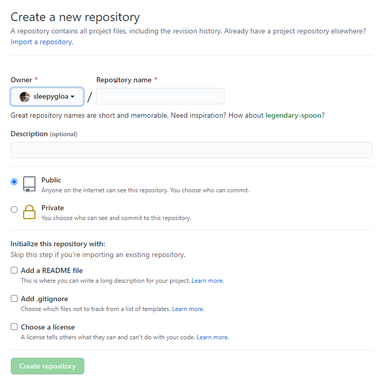
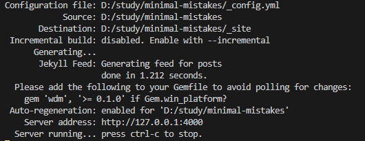

- https://devinlife.com/howto/

# 시작하기
github 에서 제공하는 page 기능을 이용하여 블로그를 만들고, 검색엔진에 노출하여 쉽게 개인기술블로그를 만들자.

jekyll 블로그는 Github이 ```Ruby``` 언어로 작성되어있어, jekyll 도 마찬가지이다.
이를 이용하기 위해선 역시 ```Ruby```를 설치해야하고, 버전관리를 위해 ```rbenv``` 를 설치하여 ```Ruby```의 버전 관리를 한다.
두 가지를 설치하면 jekyll 를 실행시킨 환경이 완성이 되는데,
```jekyll Template``` 을 찾아서 원하는 clone을 해주고, 내 ```github repository``` 에 복사를 해주면 기본적으로 내가 원하는 블로그 페이지가 완성이 된다.
로컬에서 내 포스팅을 확인하기 위해서는 ```Ruby``` 의 라이브러리(```bundler```)를 설치하면 로컬에서도 간단하게 내 블로그를 확인할 수 있다.
그 외의 포스팅 방법, 설정, SNS 연동, 검색엔진 연동 등 다양한 설정으로 나에게 맞는 블로그를 만들어보자

# 설치하기
- 맥북 기준으로 작성.

## xcode 설치
Native 확장기능을 컴파일할 수 있게 해주는 명령행 도구를 설치해야 하므로, 터미널을 열어 다음 명령을 실행합니다.
```
xcode-select --install
```

## ruby 설치
homebrew를 사용하여 루비를 설치합니다.
Jekyll 은 루비 > 2.4.0 버전을 필요로 합니다. 
맥OS 카탈리나 10.15 는 루비 2.6.3 이 기본 포함되어있어 설치 할 필요가 없으나, 이전 버전의 맥OS를 사용중이라면 설치해야합니다.
```
# Homebrew 설치
/usr/bin/ruby -e "$(curl -fsSL https://raw.githubusercontent.com/Homebrew/install/master/install)"

brew install ruby
```
ruby를 환경설정에 추가합니다.
```
echo 'export PATH="/usr/local/opt/ruby/bin:$PATH"' >> ~/.bash_profile
```
잘 설치 되었는지 확인합니다.
```
which ruby
# /usr/local/opt/ruby/bin/ruby

ruby -v
ruby 2.6.3p62 (2019-04-16 revision 67580)
```
## rbenv 설치
ruby 의 버전을 관리하기 위해 설치합니다.
각 프로그램간에는 상호호환이 되는 버전을 설치해야하기 때문에 변경시, 또는 각각의 프로젝트마다 다른 버전의 루비를 실행할 때 아주 유용합니다.
```
# Homebrew 설치
/usr/bin/ruby -e "$(curl -fsSL https://raw.githubusercontent.com/Homebrew/install/master/install)"

# rbenv 와 ruby-build 설치
brew install rbenv

# 쉘 환경에 rbenv 가 연동되도록 설정
rbenv init

# 설치상태 검사
curl -fsSL https://github.com/rbenv/rbenv-installer/raw/master/bin/rbenv-doctor | bash
```

## Jekyll 설치하기
```
gem install --user-install bundler jekyll
```
설치가 제대로 되었는지 확인합시다
```
ruby -v
ruby 2.6.3p62 (2019-04-16 revision 67580)
```
환경변수 설정을 하기 위해 X.X부분에 설치된 ruby 의 버전을 넣어 줍시다
```
echo 'export PATH="$HOME/.gem/ruby/X.X.0/bin:$PATH"' >> ~/.bash_profile
```
gem 경로가 홈 디렉토리를 가리키고 있는지 확인합니다
```
gem env
```
## VS code 설치하기
[VScode 설치하기]('https://code.visualstudio.com/')
코딩을 하기 위해서, 블로그를 작성하기 위해서 다양한 방법이 있지만
대중적으로 알려진 VScode를 설치하여 작성하기로한다.

# 3. Github 가입하기
기존 이용자는 패스하여도 된다.

[Github 나무위키]('https://namu.wiki/w/GitHub')
대표적인 무료 Git 저장소이다. 개발자들은 대부분은 Github 에 소스를 업로드하여 관리 또는 공유를 하며, 얼마전 MS 에서 인수하면서 또한번 떡상한 저장소이기도하다.
특히 저장소개념외 버전관리를 위해서도 사용하여 그외에도 다양한 기능을 제공하고있어 개발자라면 꼭 사용해야 하는 툴? 중에 하나이다.

이슈트래킹을 해준다거나, 올린 소스에 보안 취약점이 보이면 알림을 주거나, 이슈등록을 다른사람이 보고 해결 등 다양하게 이용할 수 있고.
또, 다른 점에서는 일명 잔디밭 관리, 외장하드 의 개념으로 사용하게 될 수도있는데, 이렇게 되지 않게 특히 조심하자.

[Github 가입하기]('https://github.com/join?ref_cta=Sign+up&ref_loc=header+logged+out&ref_page=%2F%3Cuser-name%3E&source=header')


# 3. Github 저장소 만들기
[Repository 만들기]('https://github.com/new')

[](./images/github-new-repository.png)

Repository name 부분에 ```username.github.io``` 형식으로 이름을 작성하고
아래에 보이는 부분은 체크없이 ```Create repository``` 버튼을 누르자.

# 4. Jekyll Template 복사하여 블로그 만들기
Jekyll Template 이란? 많은 이용자들이 jekyll 블로그를 이용하고 있고, 많은 이용자들이 또 자신만의 Template 을 만들어 사용하고 있다. 또한, 사용하기 위해서 누군가는 Template 을 만들어서 제공하고 있기도하다.
그 중 가장 많이 알려져있고, 사용하는 ```minimal-mistakes``` 을 이용하여 블로그를 만들어보자.


## 다운로드
1. 홈페이지에서 다운로드.
- minimal-mistakes : https://github.com/mmistakes/minimal-mistakes

2. 명령어를 이용한 다운로드
```
git clone https://github.com/mmistakes/minimal-mistakes
```

참고 사이트를 활용하여 자신에게 맞는 Template 를 다운받도록하자.
- http://jekyllthemes.org/
- http://themes.jekyllrc.org/
- https://jekyllthemes.io/

## Template 실행하기
해당 폴더로 이동하여 아래 명령어를 실행해보자.
```
bundle exec jekyll serve
```

아래와 같은 로그가 뜬다면 정상적으로 실행이 되는 것이다.
기본 ip와 port는 ```localhost:4000``` 으로 실행되게 됩니다.
[](./images/jekyll-first-start.png)

## 내 저장소로 Template 복사
아까 만든 저장소를 다운로드하고 jekyll template 을 복사하자.
```
git clone http://github.com/username/username.github.io 
```
다운받은 템플릿 내용 내 저장소로 복사하자
복사 한 후에는 내 저장소를 push 하여 내 블로그가 제대로 띄워지는지 확인하자.
```
git add .
git commit -m "jekyll template 추가"
git push
```
깃푸쉬를 마무리하면, 몇분 후에 github pages 의 주소로 블로그개 생성되었음을 확인할 수 있다.
> 오류가 발생하지않아야, 블로그개 생성된다. 빌드가 제대로되어야 반영되는 것과 비슷하다. 또, 오류발생시 github 에 연결된 mail 로 리포팅이 날라갈 것이다.

